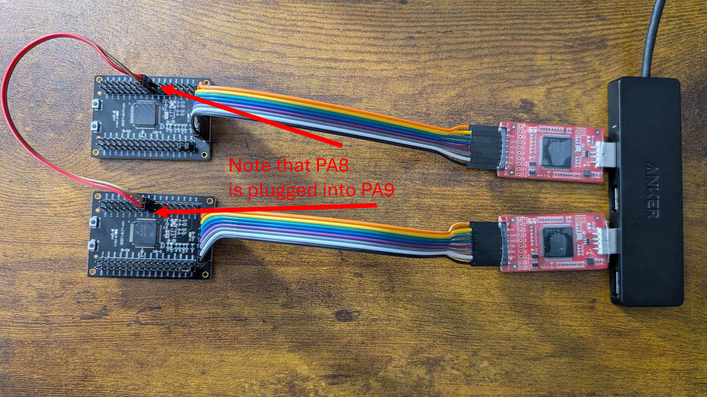

# Lakota West High School 2026 ECTF Design

## Layout

- `firmware/` - Source code to build the firmware
    - `Makefile` - This makefile is invoked by the eCTF tools when creating an HSM.
    - `Dockerfile` - Describes the build environment used by eCTF build tools.
    - `secrets_to_c_header.py` - Python file to convert from global secrets to firmware-parsable header file
    - `inc/` - Directory with C header files
    - `src/` - Directory with C source files
    - `wolfssl/` - Location to place the wolfssl library for the included Crypto Module
    - `firmware.ld` - Defines memory layout of built firmware
- `ectf26_design/` - Pip-installable module for generating secrets
    - `src/` - Secrets gen source code
        - `gen_secrets.py` - Generates shared secrets
    - `pyproject.toml` - File that tells pip how to install this module
- `Makefile` - Helper script to simplify repetitive build steps

## Installation

### Required Dependencies
- **Docker** 
- **UV**
- **Git Bash** 

### Creating a Deployment
---
```
uv venv
source .venv/Scripts/activate
uv pip install -e ./ectf26_design
uv run secrets ./global.secrets 1 2 3 0x1111
docker build -t build-hsm ./firmware`
```

### Building an HSM
---
```
docker run --rm -v "$(pwd -W)\firmware:/hsm" -v "$(pwd -W)\global.secrets:/secrets/global.secrets:ro" -v "$(pwd -W)\build:/out" -e HSM_PIN=abc123 -e PERMISSIONS="1111=-W-" build-hsm 
```
### Flashing an HSM
---
```
uvx ectf hw COMX erase
uvx ectf hw COMX flash build/hsm.bin -n hsm 
uvx ectf hw COMX start
```

## Built-In Functions
---

Each HSM can accept commands for the following 6 commands
- **List**
- **Read**
- **Write**
- **Listen**
- **Interrogate**
- **Receive**

Listen, Interrogate, and Receive require two boards connected together similar to this:


### The List Command

The List command lists all the metadata associated with the files stored on the HSM. List `is` pin protected.

Example Usage:
```
uvx ectf tools COMX list 123abc
```

### The Read Command

The read command is a function that will download a file from an HSM, allowing it to be read by the user. Read `is` pin protected.

Example Usage:
```
uvx ectf tools COMX read -f abc123 0 ./output
```

### The Write Command

The read command is a function that will write a file to an HSM. Write `is` pin protected.

Example Usage:
```
echo "test" > test.txt
uvx ectf tools COMX write 123abc 0 0x1111 ./test.txt
```

### The Listen Command

The listen command places an HSM into listen mode, which waits on other dual HSM commands, such as `interrogate` and `receive`. Listen is `not` pin protected.

Example Usage:
```
uvx ectf tools COMX listen
```

### The Interrogate Command

The interrogate command allows the listing of the other HSMs files and metadata. Interrogate `is` pin protected.

Example Usage:
```
uvx ectf tools COMX interrogate 567def
```

### The Receive Command

The receive command allows the sending of files between HSMs. Receive `is` pin protected.

Example Usage:

HSM 1:
```
uvx ectf tools COMX listen
```
HSM 2:
```
uvx ectf receive 567def 0 0
``` 
